# incumbent-optimiser

router across multiple solvers on a latency budget for compute utilisation

## Contribution split

```mermaid
xychart-beta
    title "Added-line proportion by file type"
    x-axis ["Rust", "Python", "Markdown", "Protobuf", "Docker", "Makefile"]
    y-axis "Percentage" 0 --> 100
    bar [100, 2, 42, 100, 100, 100]
    bar [0, 98, 58, 0, 0, 0]
```

This chart counts added lines in the `main` history through commit `1aa45c7`. “You” includes all non-Codex author identities; “Codex” means `Codex <codex@local.invalid>`. The chart commit itself is excluded.

The first bar in each category is yours; the second is Codex’s.

| File type | You | Codex | Added lines |
| --- | ---: | ---: | ---: |
| Rust | 100.0% | 0.0% | 231 |
| Python | 1.8% | 98.2% | 440 |
| Markdown | 41.9% | 58.1% | 415 |
| Protobuf | 100.0% | 0.0% | 22 |
| Docker | 100.0% | 0.0% | 31 |
| Makefile | 100.0% | 0.0% | 99 |
