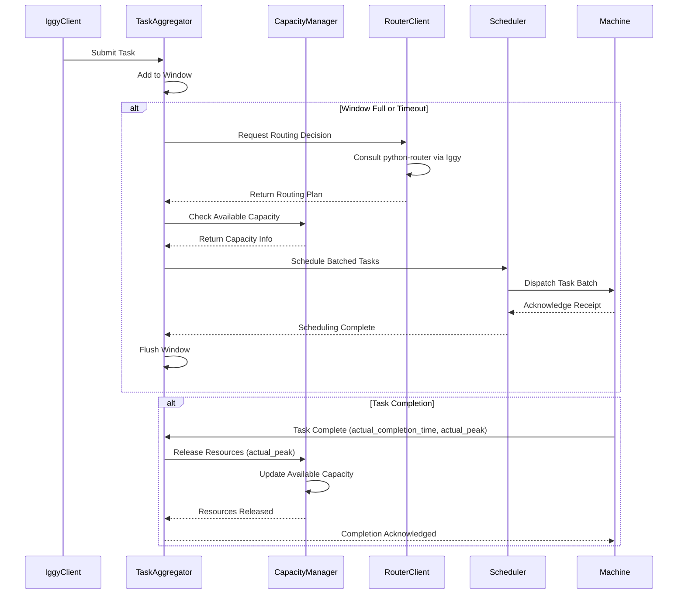

# Documentation on what the aggregator-rust service does in the incumbent optimisation project

## Explaination

### Context

The aggregator-rust service manages the window logic for the system, the implementation decision of the python-router, and the simulated machine capacity of each of the machines available. This service is fundamental in the optimization pipeline as it coordinates the scheduling and resource allocation across distributed machines. It processes incoming tasks, applies window-based aggregation strategies, and ensures efficient utilization of available computing resources through intelligent load balancing.

### Decisions

    - **Window-based Aggregation**: Tasks are batched and processed in fixed-size or time-based windows to improve throughput and reduce overhead from individual task processing.
    - **Dynamic Load Balancing**: The service monitors machine capacity in real-time and distributes tasks to machines with available resources, preventing bottlenecks.
    - **Python Router Integration**: Coordinates with the python-router service through Apache Iggy, to determine optimal routing strategies for task distribution based on current system state.
    - **Resource Allocation Strategy**: Implements intelligent capacity management that respects per-machine resource limits, anit-affinity rules and intelligent scheduling policies to ensure fair distribution of work, preventing overallocation.

## Architecture

### Components

    - **Task Aggregator**: Batches incoming tasks into configurable windows based on size or time thresholds
    - **Capacity Manager**: Tracks available resources on each machine and enforces resource constraints
    - **Router Client**: Communicates with python-router via Apache Iggy for routing decisions
    - **Scheduler**: Assigns tasks to machines based on current capacity and routing recommendations
    - **Window Manager**: Handles window lifecycle, timeout management, and flush operations
    - **Async Resource Release**: Monitors and processes completion timing on tasks, releasing the right amount (`actual_peak`) of resource when the task completes (`actual_completion_time`)

### Configuration Options

    - **Window Size**: Maximum number of tasks per window (default: 100)
    - **Window Timeout**: Maximum time to wait before flushing a window in milliseconds (default: 5000)
    - **Machine Capacity**: Per-machine resource limits (CPU, memory, task slots)
    - **Iggy Configuration**: Connection parameters for Apache Iggy broker (host, port, stream name, topic name) 

### Sequence Diagram Internal

