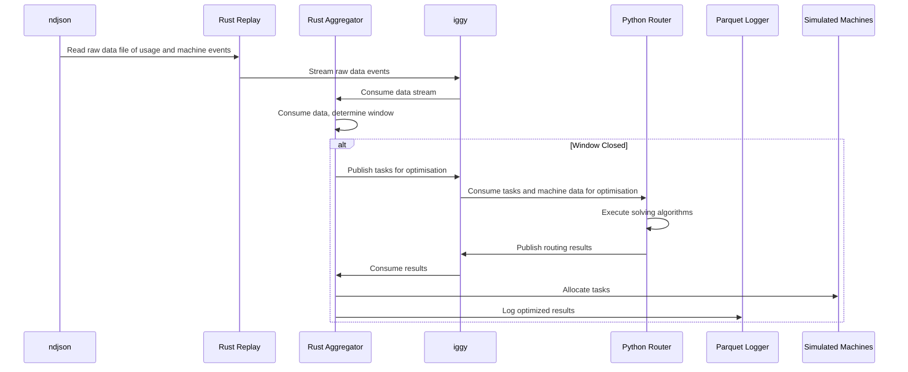

# This outlines the spec for the incumbent optimisation service, split across rust, Iggy, and python services

## Explanation

### Context

This service looks to solve the problem of efficiently processing and optimizing large datasets across distributed systems using a combination of Rust for performance-critical operations, Iggy for message streaming, and Python for executing optimisation algorithms and machine learning models for solving and routing.

### Decisions

- Use Rust for core data processing to ensure maximum performance and memory efficiency
- Leverage Iggy as the message broker for reliable inter-service communication
- Implement optimization algorithms in Python to allow flexibility and rapid iteration
- Separate concerns into distinct microservices to enable independent scaling

## Architecture

### Components

- **Replay Rust**: Core data processing engine that handles ETL, validation, and transformation of incoming datasets with high throughput and low latency
- **Aggregator Rust**: Service that manages business logic, prepares batch tasks for solving, and simulates machine capacity for task allocation
- **Iggy Message Broker**: Handles asynchronous communication between services
- **Router Python**: Executes routing algorithms to determine optimal task distribution across available resources and machine capacity
- **API Gateway**: Provides REST/gRPC endpoints for client access
- **Protos**: Defines protocol buffer schemas for type-safe serialization and communication between services

### Sequence Diagram

