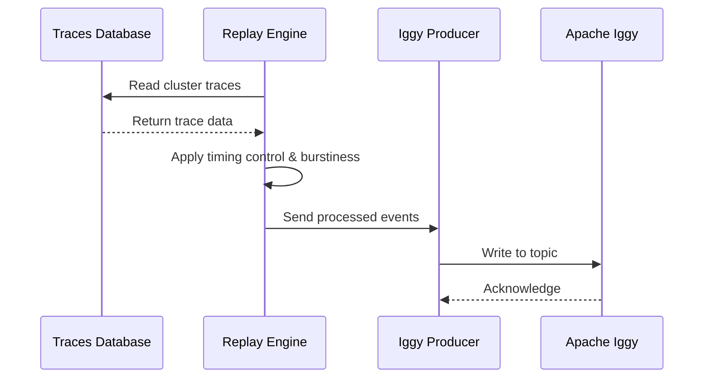

# Documentation for the replay-rust service

## Explanation

### Context

The replay rust service sits on top of the traces database, and acts as the sumilated submission layer. It manages the reading of the cluster data, and the control over the timing of writing that data to Apache Iggy, including the burstiness or randomness of that data.

The replay-rust service does not touch the workings of the windowing or solution of the allocation, and once it writes to Iggy, there is no more work to be done by the replay service.

### Decisions

    - **Decision 1**: The service reads from a traces database rather than generating synthetic data, ensuring realistic cluster patterns
    - **Decision 2**: Timing control is implemented in the replay service to simulate production burstiness and network patterns
    - **Decision 3**: Apache Iggy is used as the message broker for decoupling the replay service from downstream consumers
    - **Decision 4**: The service maintains no state about windowing or allocation solutions, keeping concerns separated

## Architecture

### Components

    - **Traces Database**: Stores historical cluster data used for replay in a json file
    - **Replay Engine**: Reads traces and controls timing of data emission
    - **Apache Iggy Producer**: Writes processed traces to Iggy topics
    - **Configuration Manager**: Manages replay parameters (speed, burstiness, randomness)

### Configuration Options

    - `replay_speed`: Multiplier for playback speed (1.0 = real-time, 2.0 = 2x speed)
    - `burstiness_factor`: Controls clustering of events (0.0 = uniform, 1.0 = highly bursty)
    - `randomness_seed`: Optional seed for reproducible randomisation
    - `start_timestamp`: Beginning of trace window to replay
    - `end_timestamp`: End of trace window to replay

### Sequence Diagram Internal

